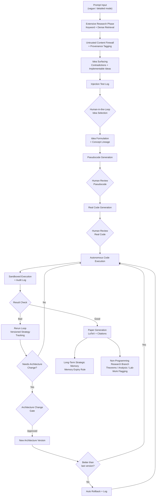

## Project Information

- **Team Name:** slayers
- **Project Title:** Self-Evolving Autonomous Research Agent
- **Track/Theme:** Agentic Ecosystem

---

## Project Description

A secure research and computer-use agent that turns an open-ended question into a reproducible, evidence-backed research package — combining live retrieval, document analysis, sandboxed code execution, and controlled self-improvement, without ever letting the agent silently rewrite its own trusted control layer.

The agent researches a topic across papers and live sources, surfaces implementable ideas and contradictions in the literature, drafts and formulates a concept with the user in the loop, generates pseudocode and real code under human approval gates, executes it in an isolated sandbox, and — on success — auto-generates a fully cited LaTeX research paper. Every strategy change the agent proposes for itself is versioned, tested against held-out tasks, and reversible.

The defining feature is **governed self-evolution**: the agent may propose better prompts, retrieval strategies, or execution configs, but nothing becomes trusted behavior without evaluation, logging, and a rollback path.

---

## Technical Stack

- **Frontend:** React, Monaco Editor / syntax-highlighted live code viewer, WebSocket-driven trace/event stream panel
- **Backend:** Python (FastAPI)
- **LLM Providers:** Groq (Llama 3.3 70B / GPT-OSS 120B) as primary, Gemini as automatic failover
- **Code Execution Sandbox:** E2B (Firecracker microVM isolation, disposable sessions, network allowlisting)
- **Document Generation:** LaTeX (Tectonic / pdflatex, compiled inside the sandbox)
- **Retrieval:** Hybrid keyword + dense (embedding) retrieval across papers and live web sources
- **Storage:** Evidence graph + versioned strategy store + long-term project memory with expiry rules

---

## Workflow Diagram

---

## Security & Safety Features

- Untrusted content firewall for all scraped/retrieved material (prompt-injection defense)
- Provenance and timestamp tracking on every piece of evidence
- Injection attempt logging (visible, not silently discarded)
- Isolated, disposable sandbox execution with network allowlisting and audit logs
- Human approval gates at every sensitive decision point (idea selection, pseudocode, code, architecture changes)
- Versioned strategy tracking with automatic rollback on regression
- Memory expiry to prevent unbounded context/data accumulation

---

